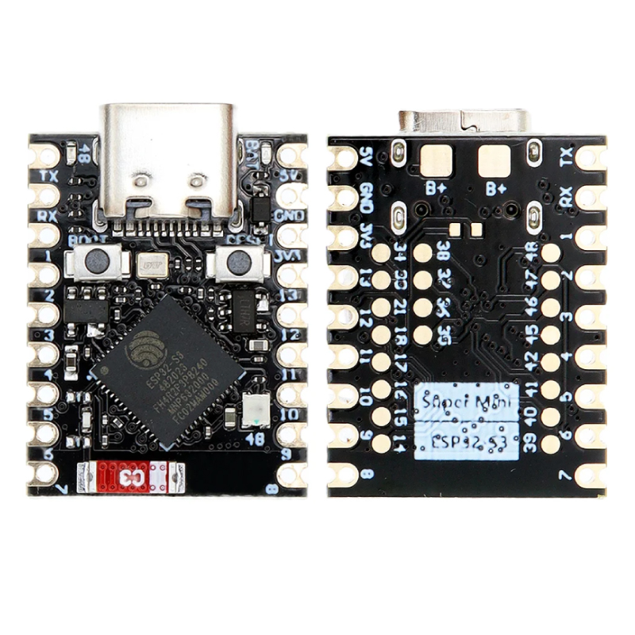
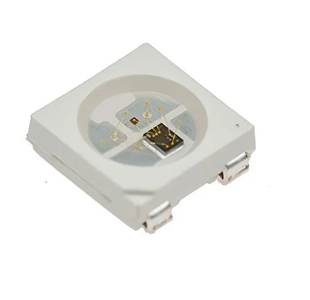

# Diagrama de Flujo del Sistema

## TP2 — Detección de Colores y Control mediante Visión Artificial

---

## Objetivo del sistema

El sistema tiene como objetivo detectar colores en tiempo real mediante visión artificial utilizando una cámara web, procesar la información mediante OpenCV y controlar un microcontrolador ESP32-S3 que actuará sobre un LED WS2812B según el color detectado.

---

## Componentes principales

### Hardware utilizado

#### Cámara Web
- **Modelo:** Redragon HD 720P


---

#### Microcontrolador
- **Modelo:** ESP32-S3 SuperMini
- **Comunicación:** Serial USB



---

#### Actuador LED
- **Modelo:** WS2812B RGB Addressable LED



---

## Arquitectura general del sistema

```text
┌────────────────────┐
│ Cámara Redragon    │
│ HD 720P            │
└─────────┬──────────┘
          │
          ▼
┌────────────────────┐
│ Captura de imagen  │
│ OpenCV VideoCapture│
└─────────┬──────────┘
          │
          ▼
┌────────────────────┐
│ Conversión BGR→HSV │
│ Segmentación HSV   │
└─────────┬──────────┘
          │
          ▼
┌────────────────────┐
│ Máscaras binarias  │
│ Conteo de píxeles  │
└─────────┬──────────┘
          │
          ▼
┌────────────────────┐
│ Toma de decisiones │
│ Color predominante │
└─────────┬──────────┘
          │
          ▼
┌────────────────────┐
│ Comunicación Serial│
│ Python → ESP32-S3  │
└─────────┬──────────┘
          │
          ▼
┌────────────────────┐
│ ESP32-S3           │
│ Control WS2812B    │
└─────────┬──────────┘
          │
          ▼
┌────────────────────┐
│ LED RGB WS2812B    │
│ Indicación visual  │
└────────────────────┘  
```

---

### Flujo de funcionamiento

#### 1. Captura de imagen

La cámara Redragon HD 720P captura imágenes en tiempo real mediante OpenCV utilizando la función:

```python
cap = cv2.VideoCapture(0)
```

Cada frame obtenido será utilizado como entrada para el sistema de procesamiento.

#### 2. Procesamiento y detección de colores

Cada imagen capturada pasa por varias etapas:

##### Conversión de espacio de color
La imagen original en formato BGR se transforma al espacio HSV:

```python
hsv = cv2.cvtColor(frame, cv2.COLOR_BGR2HSV)
```

##### Generación de máscaras binarias
Se crean máscaras independientes para:
- Rojo
- Verde
- Amarillo

Utilizando la función:
```python
cv2.inRange()
```
El color rojo requiere dos máscaras independientes debido a la naturaleza circular del canal Hue.

##### Filtrado y cuantificación
Las máscaras binarias permiten:
- Eliminar ruido.
- Aislar regiones de interés.
- Contar píxeles activos.

La cuantificación se realiza mediante la función:
```python
cv2.countNonZero()  
```

#### 3. Toma de decisiones

El sistema compara la cantidad de píxeles detectados para cada color.

La lógica determina:
- Si existe un color predominante.
- Si supera el umbral mínimo.
- Si la detección es estable durante varios frames consecutivos.

El resultado final genera un comando:

| Color | Comando |
| :--- | :---: |
| Rojo | `R` |
| Verde | `G` |
| Amarillo | `Y` |
| Ninguno | `N` |

#### 4. Comunicación serial

Python transmite el resultado al ESP32-S3 mediante comunicación serial USB.

Ejemplo:
```python
serial.write(b'R')
```

La comunicación permite desacoplar:
- El procesamiento de visión.
- La actuación embebida.  

#### 5. Actuación del microcontrolador

El ESP32-S3 recibe el comando serial y controla el LED WS2812B integrado.

##### Respuesta esperada

| Comando | Acción |
| :---: | :--- |
| `R` | LED rojo |
| `G` | LED verde |
| `Y` | LED amarillo |
| `N` | LED apagado |

El microcontrolador ejecuta continuamente un sistema de lectura serial y actualización del LED RGB.

---

### Consideraciones técnicas

#### Ventajas del sistema
- Procesamiento desacoplado.
- Detección robusta mediante HSV.
- Bajo costo de implementación.
- Retroalimentación visual inmediata.
- Arquitectura modular y escalable.

#### Resultado esperado
El sistema debe ser capaz de:  
- **a)** Detectar colores en tiempo real.  
- **b)** Transmitir correctamente el resultado.  
- **c)** Actuar físicamente mediante el ESP32-S3 y el LED WS2812B.  

El funcionamiento debe mantenerse estable bajo diferentes condiciones de iluminación y escenarios de prueba.